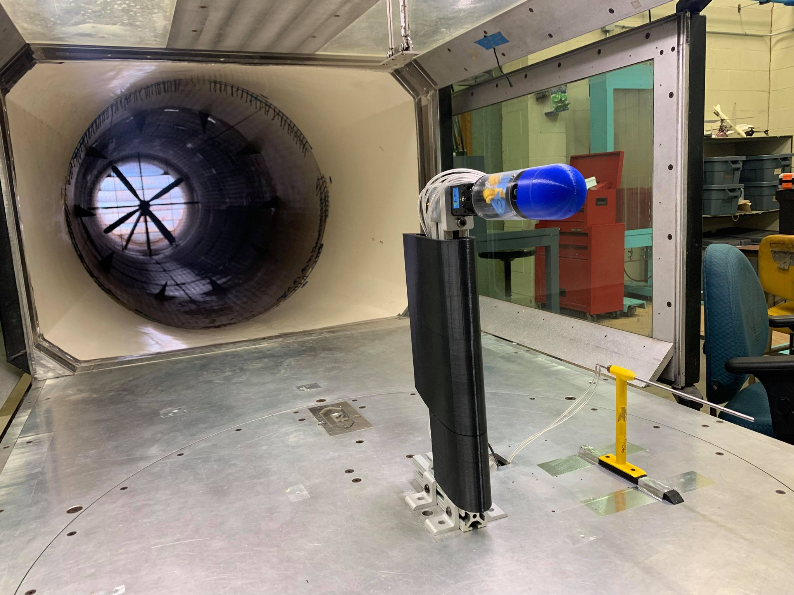
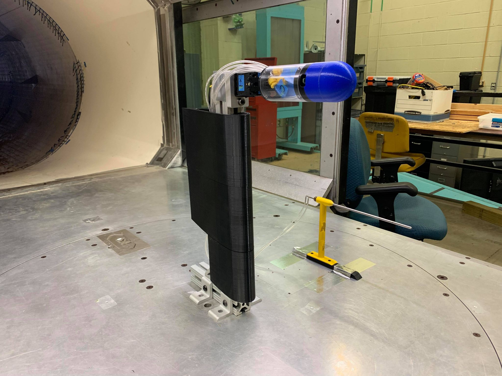
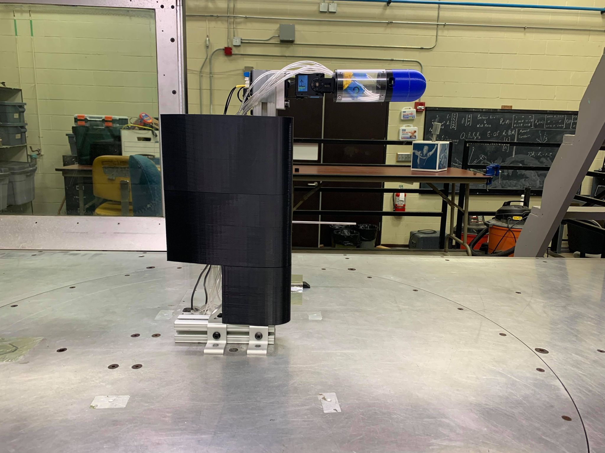
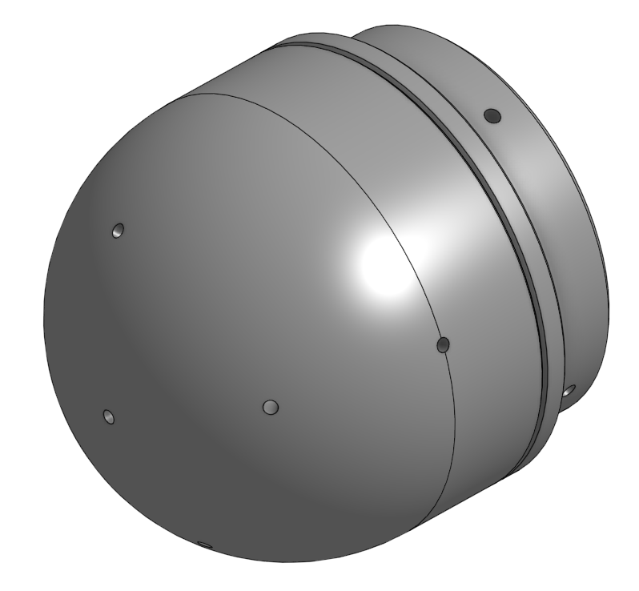
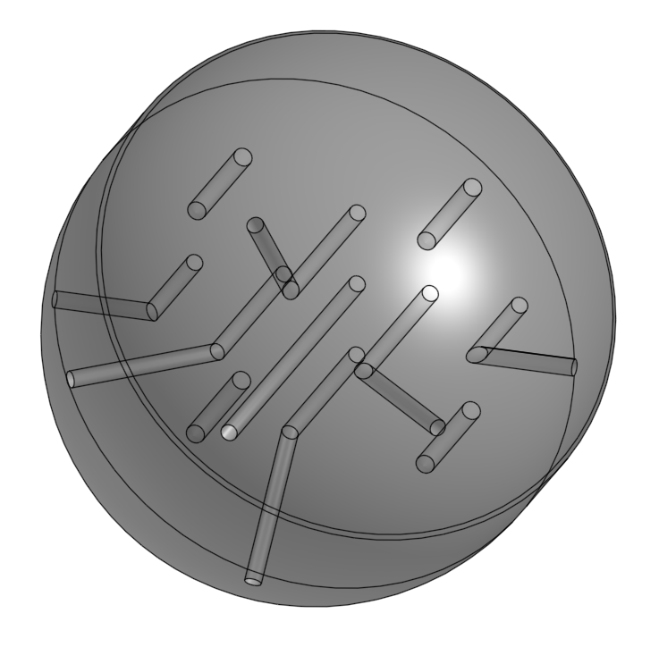
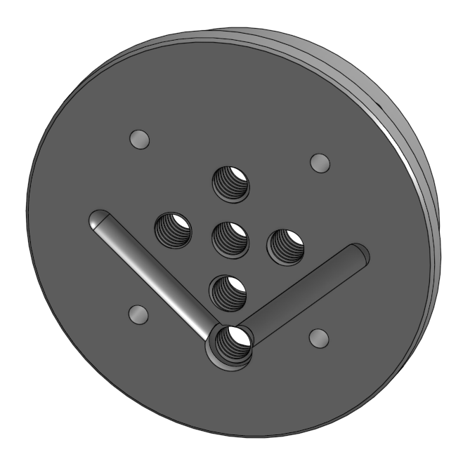
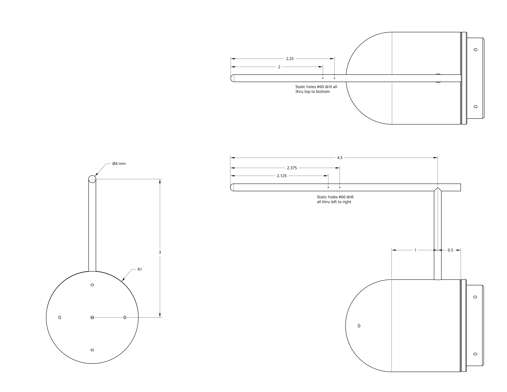

# 2021-09 probe configuration comparison data

## Objective

The objective of this experiment was to compare two configurations of 5-hole
low-cost probe noses with additional static pressure sensing.

## Setup

The probe noses were installed in the 2 by 3 foot wind tunnel at the University
of Kansas, Wichita. The mounting included an altazimuth servomechanism actuated
by a Dynamixel [2XL430-W250-T](https://www.robotis.us/dynamixel-2xl430-w250-t/)
servo. We gathered pressures using a Scanivalve pressure scanner. We used a
Python program to command the Dynamixel servo and collect sweeps of pressures at
different angles of attack and yaw.

We determined tunnel dynamic pressure, _q_, from a Pitot-static probe mounted in the
tunnel. All pressures were measured relative to tunnel static pressure, which we
obtained from the same Pitot-static probe.

## Test articles

The test articles were 3D printed at 0.2mm layer heights. All pressure holes in the plastic
parts were 1/16" nominal diameter.

### Two hole static head

This article attempted to measure static pressure by placing two holes, one on
either side, at 90 degrees from the centerline on the ball nose. The head contains
3D printed 1/16" passages. The mounting plate contains passages that connect the
left and right side holes into a common plenum.

### Static probe head

This article attempted to add an "explicit" source of static pressure by building in
an idiomatic static pressure source. This was made of 4mm diameter brass tubes and drilled
appropriately with a #60 drill. (Click on drawing for full resolution image.)

## Data

For the two hole static head, we obtained sweeps at 5, 15, and 20 psf dynamic pressure.

For the static probe head, we obtained sweeps at 5 and 20 psf dynamic pressure.

For higher dynamic pressures, we swept through smaller angles because we discovered that
the Dynamixel servo we used had inadequate holding torque for large deflections at large
dynamic pressures.

The data is in a series of CSV files in this directory. The columns of the CSV files are:

1. Angle of attack, alpha
2. Angle of yaw, beta
3. Tunnel _q_, dynamic pressure from Pitot-static probe.
4. Center hole.
5. Static pressure -- either two-hole or our own static probe.
6. Up hole.
7. Down hole.
8. Left hole.
9. Right hole.

