# 2022-07 wind tunnel testing

## Introduction

This data represents wind tunnel testing for a series of probe nose configurations.

## Experimental setup

We constructed a wind tunnel fixture that moved the test article in the α and ß axes using two Dynamixel servos

<video src="./fixture.mp4" controls preload></video>

The electronics contained motor control parts as well as an ESP32 development board, an I2C mux, and eight Honeywell pressure sensors:

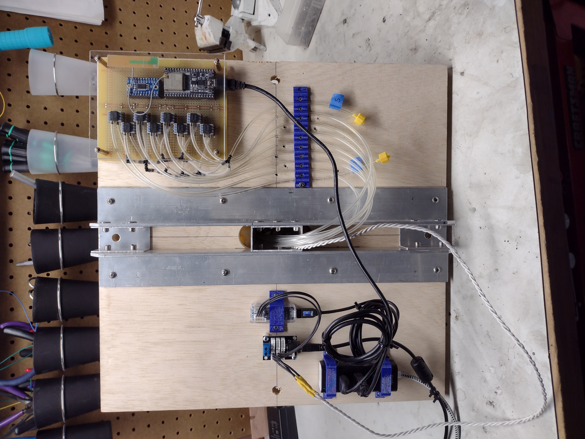

All sensor readings were taken relative to static pressure. Sensor _0_ was always reading from a Pitot probe, providing an estimate of free stream tunnel dynamic pressure, or "tunnel _q_".

The static and Pitot pressures were obtained from a pair of probes made from 1/4" tubes, somewhat downstream of the test section:

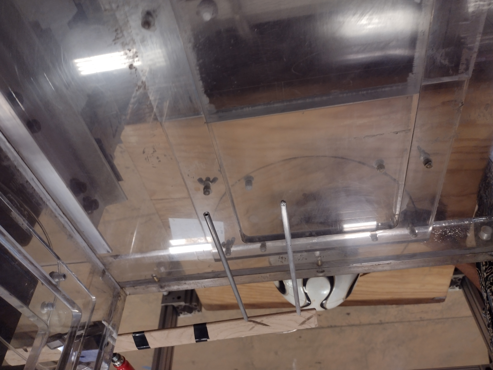

We used Luer-Lock connectors extensively to allow rapid changing of the tunnel test article:

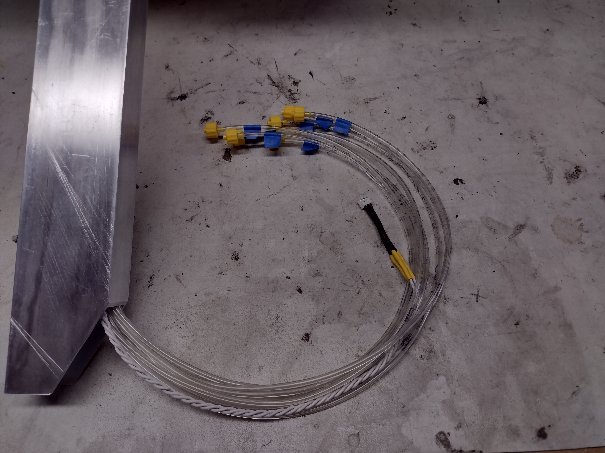

## Configurations

We tested several "configurations" -- a combination of a test article and a mapping of the pressure sensors. All the test articles involved some kind of ball nose probe, and in all cases, the ball nose was 2 inches in diameter. In all cases, the pressure tap holes were 1/16" diameter.

### `c01` 5 hole plus static plenum

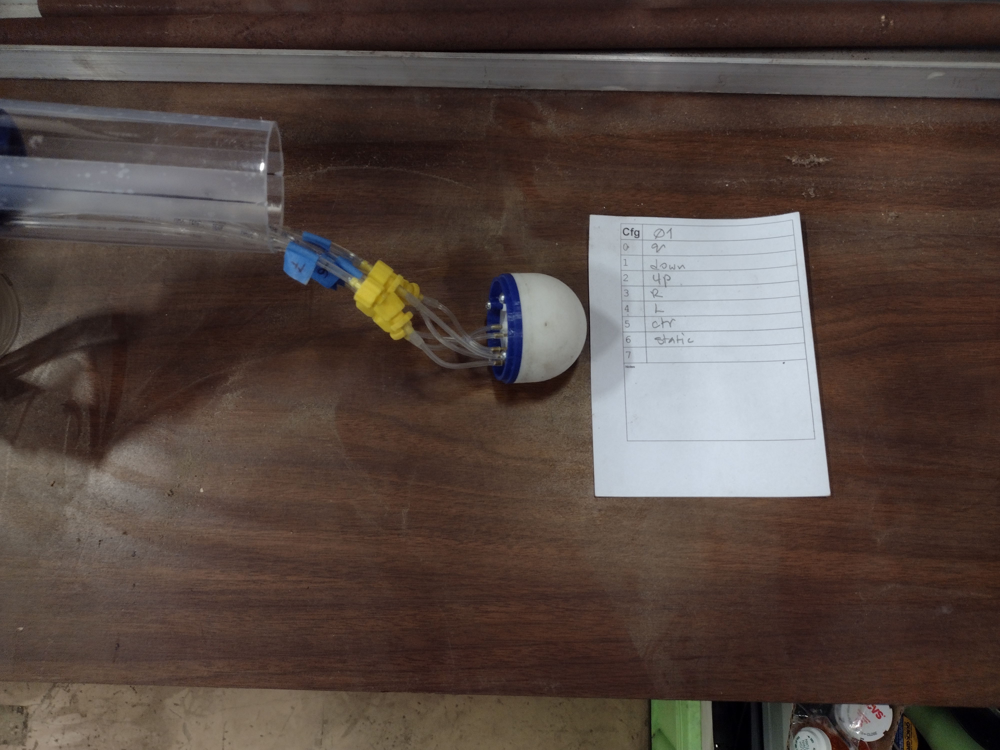
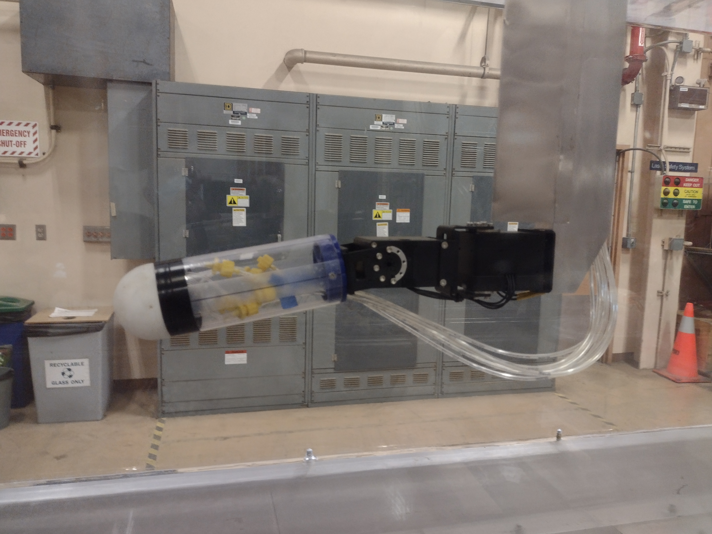

5 hole ball nose. 2 static pressure holes at the 90 degree locations, left and right, leading up to a central plenum. 3D printed from SLS Nylon.

| Sensor | Assignment    |
| ------ | ------------- |
| `0`    | Tunnel _q_    |
| `1`    | Lower hole    |
| `2`    | Upper hole    |
| `3`    | Right hole    |
| `4`    | Left hole     |
| `5`    | Center hole   |
| `6`    | Static plenum |
| `7`    |               |

### `c02` Same as `c01` with drilling

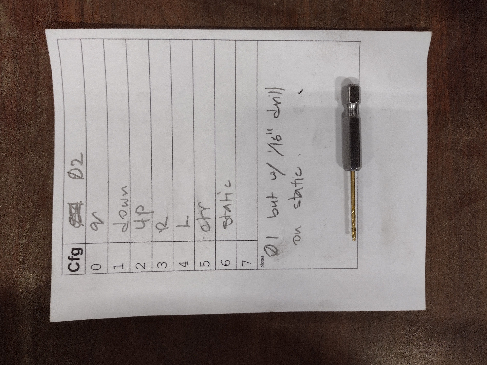

Same test article as `c01`, but the two static pressure holes were drilled out (to clean up the 3D printed shape) by twirling a 1/16" drill bit carefully within them.

| Sensor | Assignment    |
| ------ | ------------- |
| `0`    | Tunnel _q_    |
| `1`    | Lower hole    |
| `2`    | Upper hole    |
| `3`    | Right hole    |
| `4`    | Left hole     |
| `5`    | Center hole   |
| `6`    | Static plenum |
| `7`    |               |

### `c03` Same as `c0` with HP MJF

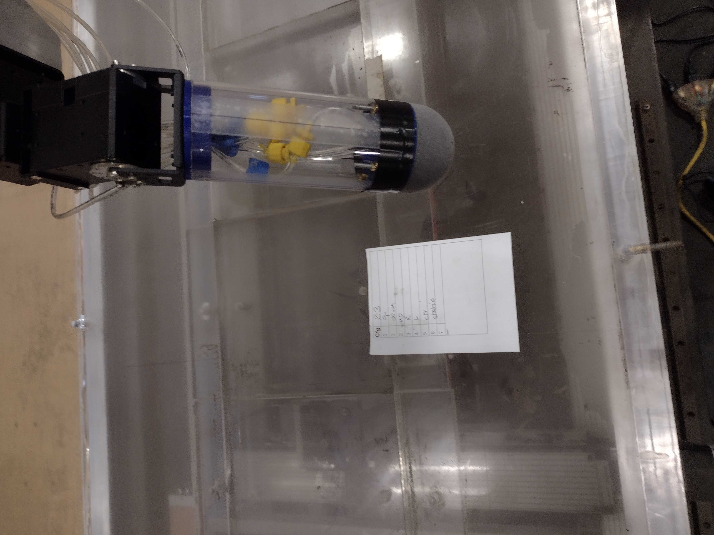

Similar geometry to test article `c01` but manufactured from HP Multi-Jet Fusion (MJF) 3D printing technology.

| Sensor | Assignment    |
| ------ | ------------- |
| `0`    | Tunnel _q_    |
| `1`    | Lower hole    |
| `2`    | Upper hole    |
| `3`    | Right hole    |
| `4`    | Left hole     |
| `5`    | Center hole   |
| `6`    | Static plenum |
| `7`    |               |

### `c04` Test of alternative static pressure probe

Testing a static probe made of a 4mm brass tube above the ball nose, with static pressure holes drilled in the sides in a ring. Demonstrate, among other things, the interaction of the ball nose with the readings in the static probe.

| Sensor | Assignment   |
| ------ | ------------ |
| `0`    | Tunnel _q_   |
| `1`    | Static probe |
| `2`    |              |
| `3`    |              |
| `4`    |              |
| `5`    |              |
| `6`    |              |
| `7`    |              |

### `c05` Static plenum holes moved back

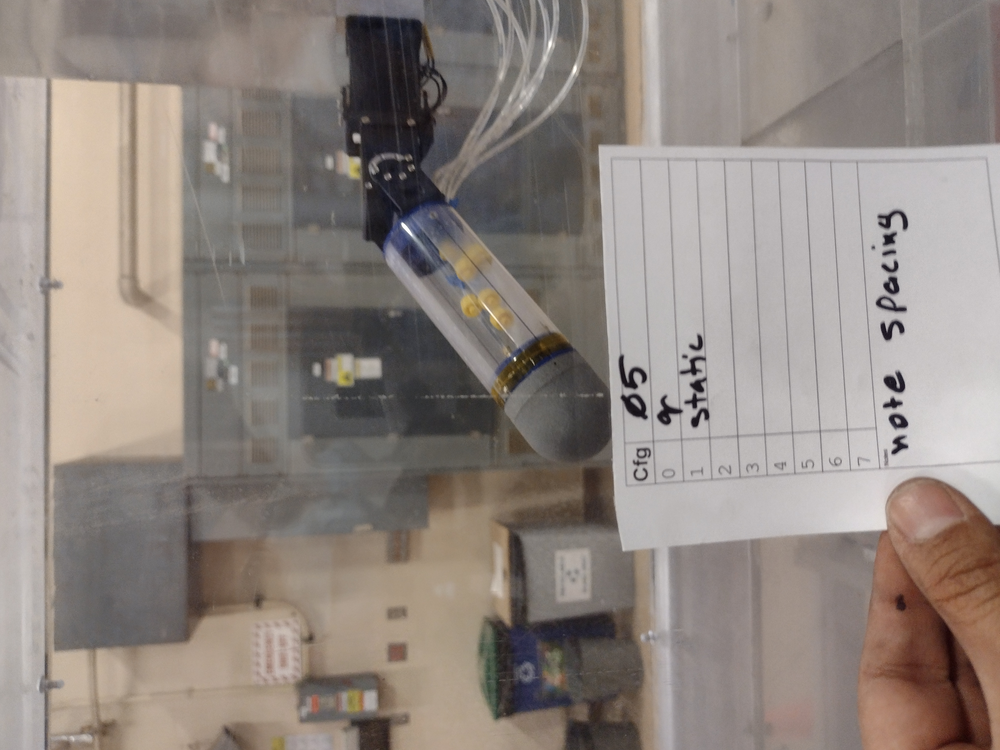

Testing a case where the static plenum holes are spaced about 1/2" behind the 90-degree location.

| Sensor | Assignment    |
| ------ | ------------- |
| `0`    | Tunnel _q_    |
| `1`    | Static plenum |
| `2`    |               |
| `3`    |               |
| `4`    |               |
| `5`    |               |
| `6`    |               |
| `7`    |               |

## Data files

Data files under `../data/` are named:

> `c`_n`_`_q_`.

where _n_ represents a configuration number, and _q_ represents the setting of the wind tunnel "speed" dial. Therefore:

> `c01_05.csv`

represents configuration `01` for a wind tunnel speed dial setting of `5`.

Each file consists of a series of lines of the format:

> α, ß, _pc0_, _pc1_, ..., _pc7_

where (α, ß) represent the angles of attack and sideslip, respectively, and _pc0_ through _pc7_ represent the raw pressure sensor integer readings for pressure sensors _0_ through _7_. An example of a line in a file is:

> `-45,-45,8825,8024,7988,7969,7951,7963,7959,7949`

The sensor readings are to be interpreted relative to the calibration curves in `../data/esp32_scanner.cal`. This file contains lines of the form:

> _p_, _pc0_, _pc1_, ..., _pc7_

where _p_ is a known pressure applied with a water manometer, and _pc0_ through _pc7_ are the raw pressure sensor integer readings for pressure sensors _0_ through _7_ at that pressure. An example of a line in this file is:

> `-995.360000,6572,6577,6577,6563,6582,6592,6591,6573`

The file `roomfan.csv` is a file similar to the above, but for a test run with a household fan. This test was done in the workshop to verify that everything was working, prior to moving the fixtures to the wind tunnel.

## Sensor calibration curves

The following are the plotted claibration curves for the sensors, showing the differences between the "theoretical" output and the corrected data points obtained via water manometer calibration.

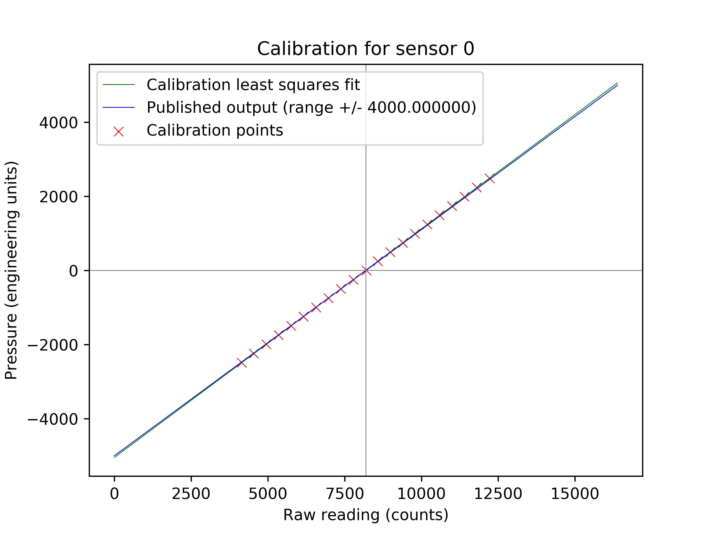

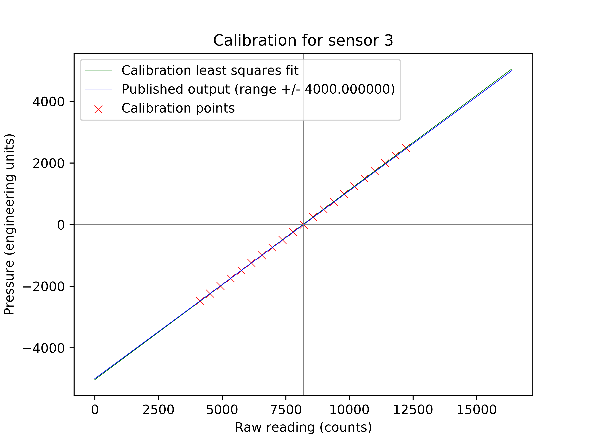
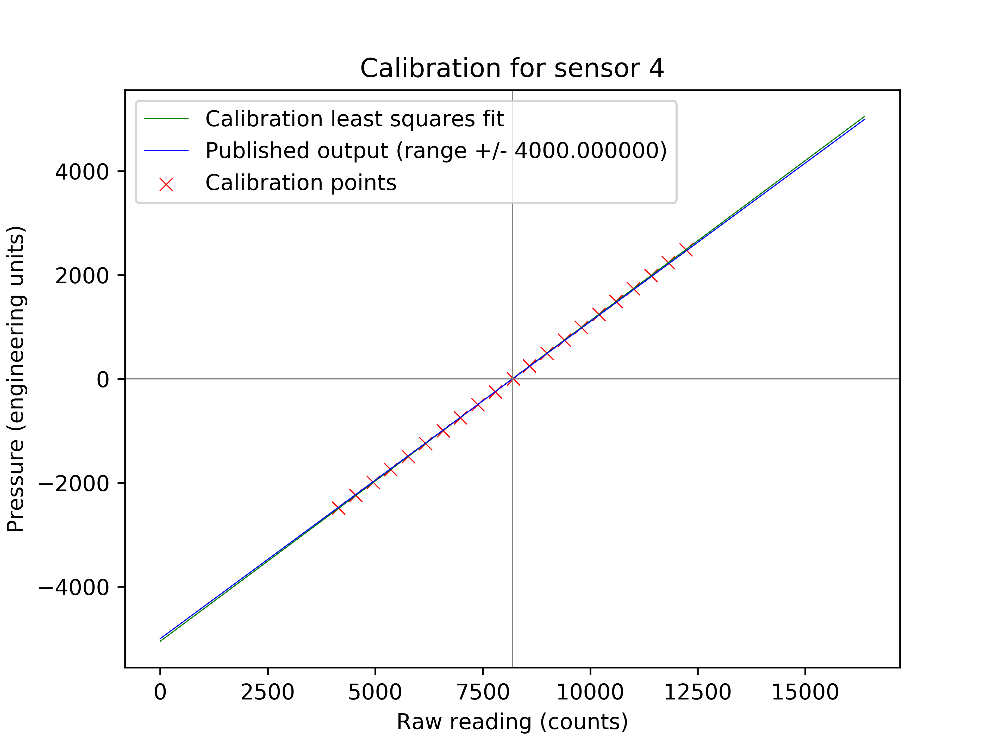
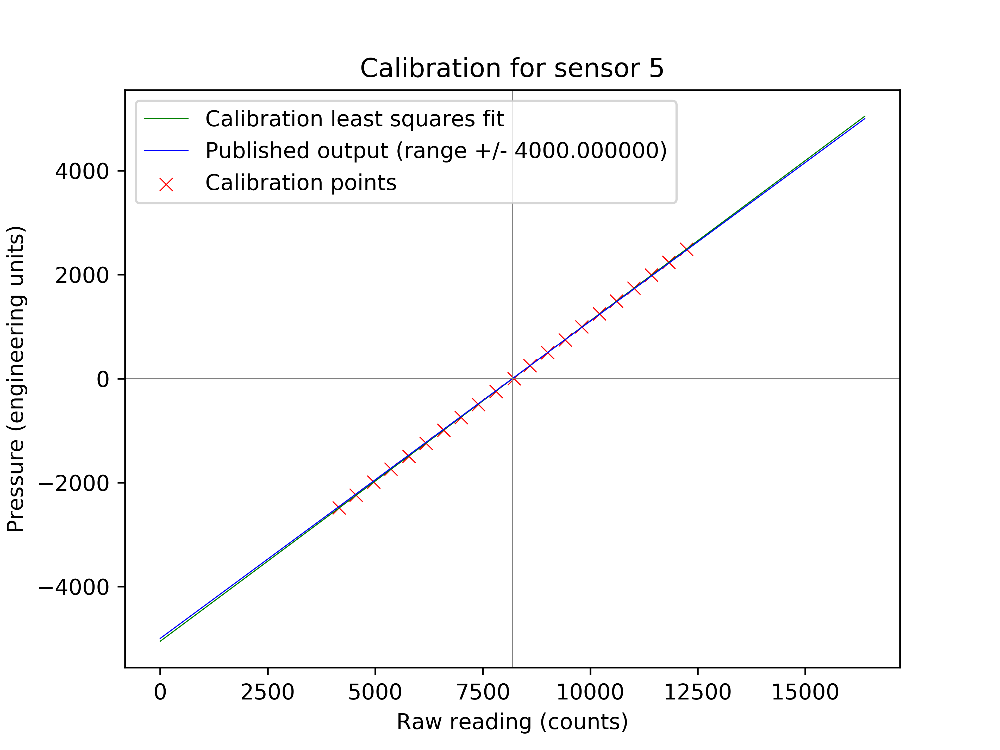
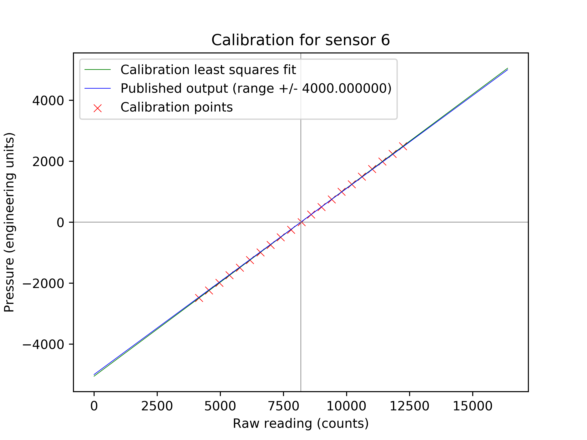

